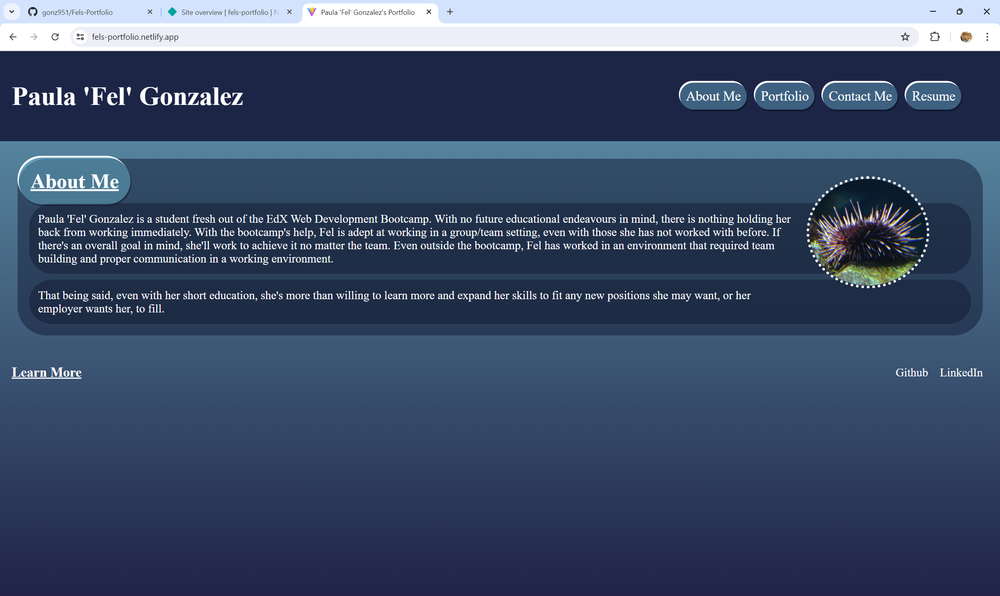
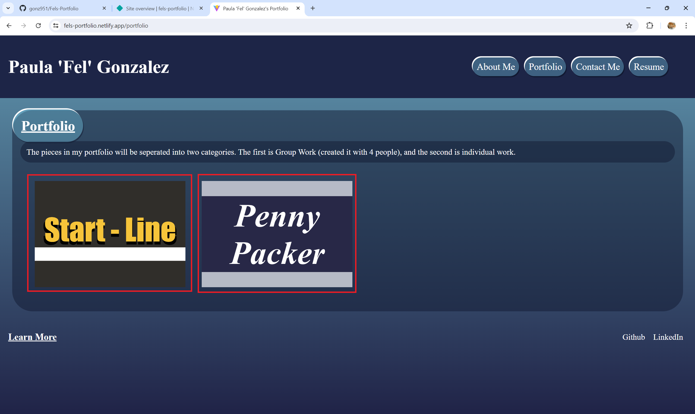
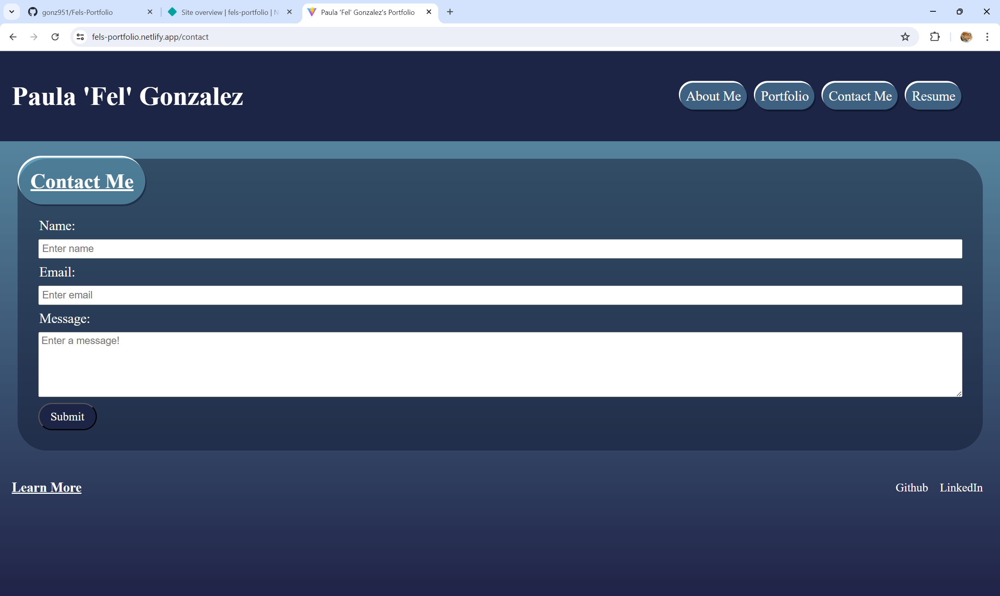
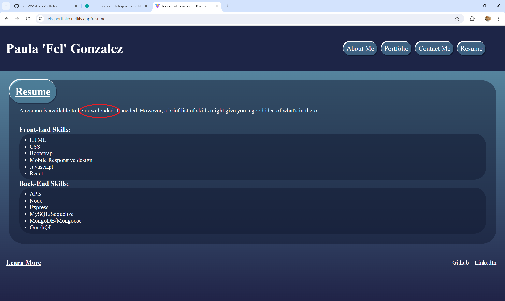

# Fels-Portfolio

## Description

This portfolio is not only a demonstration on using React to make a website, but also a portfolio to showcase my other skills. While the site itself is static, it's main purpose is to advertise myself as a valuable asset for future coding endeavours.

## Installation

With the use of 'npm i', 'npm run build', and 'npm run start', the project will be running smoothly. However, this portfolio is also available on Netlify: 
[Fel's Portfolio](https://fels-portfolio.netlify.app/)

## Usage

The first page is static, there's not much to do besides read. However, the navigation buttons will take you to other pages such as:

The portfolio page. It holds the projects that are fully completed with little to no errors and act as my portfolio pieces. The pictures on the page act as links to those projects.

The contact page. It has a simple form that accepts (requires) a name, email, and message in order to contact me.

The resume page. While my resume isn't visible, it's easily downloadable if one were to click the underlined 'download' text. It also has a short list of my technical skills if the resume isn't needed.

## License

https://choosealicense.com/licenses/mit/

MIT License

    Copyright (c) 2024 Paula 'Fel' Gonzalez
    
    Permission is hereby granted, free of charge, to any person obtaining a copy
    of this software and associated documentation files (the "Software"), to deal
    in the Software without restriction, including without limitation the rights
    to use, copy, modify, merge, publish, distribute, sublicense, and/or sell
    copies of the Software, and to permit persons to whom the Software is
    furnished to do so, subject to the following conditions:
    
    The above copyright notice and this permission notice shall be included in all
    copies or substantial portions of the Software.
    
    THE SOFTWARE IS PROVIDED "AS IS", WITHOUT WARRANTY OF ANY KIND, EXPRESS OR
    IMPLIED, INCLUDING BUT NOT LIMITED TO THE WARRANTIES OF MERCHANTABILITY,
    FITNESS FOR A PARTICULAR PURPOSE AND NONINFRINGEMENT. IN NO EVENT SHALL THE
    AUTHORS OR COPYRIGHT HOLDERS BE LIABLE FOR ANY CLAIM, DAMAGES OR OTHER
    LIABILITY, WHETHER IN AN ACTION OF CONTRACT, TORT OR OTHERWISE, ARISING FROM,
    OUT OF OR IN CONNECTION WITH THE SOFTWARE OR THE USE OR OTHER DEALINGS IN THE
    SOFTWARE.

## Questions

If you have any questions, please contact me through either:
My GitHub: https://github.com/gonz951

Or email: felgonzalez951@gmail.com
